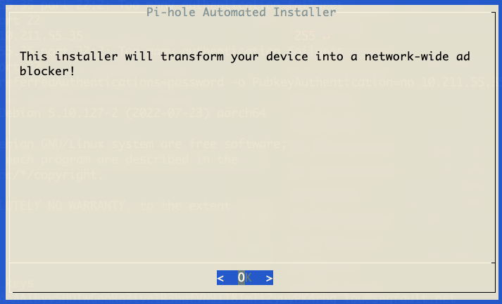

### Installieren benötigter Pakete
```bash
apt install -y wireguard net-tools tcpdump htop curl vim iptables
```

### WireGuard einrichten

#### Keys erstellen


```bash
cd /etc/wireguard/
umask 077 ; wg genkey | tee client_privatekey | wg pubkey > client_publickey ; echo "privkey: `cat client_privatekey`" ; echo "pubkey: `cat client_publickey`" 
```

den PublicKey kann man nun auf der OVPN Seite eintragen und eine WireGuard Konfiguration erstellen lassen...<br>
Bei OVPN im Webinterface einloggen und auf WireGuard/Konfigurationsdateien klicken.<br>
Hier an meinem Beispiel mit dem PublicKey 'JMBjhNdB/eAfdwoU2MrVMaMEmT0UbNltjgx62cCRwBE=' und einem Server aus Österreich.<br>
**Bitte unten nur auf Konfiguration anzeigen klicken, wir brauchen nicht alles ;)**




Auf dem Server legen wir nun eine wg0.conf an und befüllen diese:

```bash
cat > /etc/wireguard/wg0.conf << EOF
[Interface]
PrivateKey = DEIN_PRIVATE_KEY
Address = DEINE_VPN_IP
PreUp = /usr/local/bin/tunnel_up
PostDown = /usr/local/bin/tunnel_down


[Peer]
PublicKey = SERVER_PUBKEY
AllowedIPs = 0.0.0.0/0, ::/0
Endpoint = SERVER
EOF
```

Öffnet die Datei nun in einem Editor (vim/nano...) und fügt an den richtigen Stellen anstatt den Platzhaltern eure Daten ein:

danach geht es weiter mit den Dateien für Firewall/routing:


##### Tunnel up/down executables
```bash
cat > /usr/local/bin/tunnel_up << EOF
#!/bin/bash
iptables-restore /etc/iptables/pre_up.rules
echo 1 > /proc/sys/net/ipv4/ip_forward

exit 0
EOF
```
##### /usr/local/bin/tunnel_down
```bash
cat > /usr/local/bin/tunnel_down << EOF
#!/bin/bash
echo 0 > /proc/sys/net/ipv4/ip_forward
iptables-restore /etc/iptables/post_down.rules

exit 0
EOF
```

```bash
chmod +x /usr/local/bin/tunnel_*
```

##### Firewall regeln

```bash
mkdir /etc/iptables/
```

```bash
cat > /etc/iptables/pre_up.rules <<EOF
*filter
:INPUT DROP [0:0]
:FORWARD DROP [0:0]
:OUTPUT ACCEPT [0:0]

-A INPUT -i lo -j ACCEPT
-A INPUT -i w+ -j ACCEPT
-A INPUT -i e+ -j ACCEPT
-A FORWARD -i e+ -o w+ -j ACCEPT
-A FORWARD -i w+ -o e+ -j ACCEPT
-A INPUT -m state --state ESTABLISHED,RELATED -j ACCEPT
COMMIT

*nat
:PREROUTING ACCEPT [0:0]
:INPUT ACCEPT [0:0]
:OUTPUT ACCEPT [0:0]
:POSTROUTING ACCEPT [0:0]
-A POSTROUTING -o w+ -j MASQUERADE
COMMIT

*mangle
:PREROUTING ACCEPT [0:0]
:INPUT ACCEPT [0:0]
:FORWARD ACCEPT [0:0]
:OUTPUT ACCEPT [0:0]
:POSTROUTING ACCEPT [0:0]
COMMIT

*raw
:PREROUTING ACCEPT [0:0]
:OUTPUT ACCEPT [0:0]
COMMIT
EOF
```

```bash
cat > /etc/iptables/post_down.rules <<EOF
*filter
:INPUT ACCEPT [0:0]
:FORWARD DROP [0:0]
:OUTPUT ACCEPT [0:0]
COMMIT

*nat
:PREROUTING ACCEPT [0:0]
:INPUT ACCEPT [0:0]
:OUTPUT ACCEPT [0:0]
:POSTROUTING ACCEPT [0:0]
COMMIT

*mangle
:PREROUTING ACCEPT [0:0]
:INPUT ACCEPT [0:0]
:FORWARD ACCEPT [0:0]
:OUTPUT ACCEPT [0:0]
:POSTROUTING ACCEPT [0:0]
COMMIT

*raw
:PREROUTING ACCEPT [0:0]
:OUTPUT ACCEPT [0:0]
COMMIT
EOF
```

##### Final
WireGuard ist nun eingerichtet und kann testweise gestartet werden: 
```bash
wg-quick up wg0
```
sollten hier nicht mit einem Fehler abgebrochen werden, kann nach ca 5 Sekunden eine Abfrage nach der neuen öffentlichen IP gemacht werden: 

```bash
curl ipinfo.io
```
Hier sollte nun eine IP und Daten des VPN Providers stehen.
Falls dies Erfolgreich war kann WireGuard in den "Autostart" wandern

```bash
wg-quick down wg0
systemctl enable --now wg-quick@wg0.service
```

