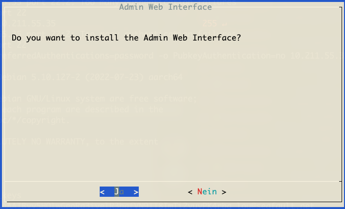
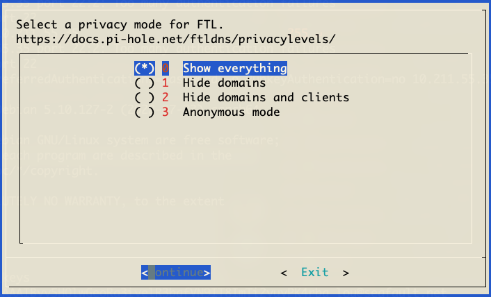

## Vorwort

In diesem Tutorial gehen wir davon aus, dass Ihr einen Raspberry Pi oder ein ähnliches Gerät habt und auf diesem eine Installtion von DietPI (oder auch ein nacktes Debian) läuft und ihr solltet per SSH als Benutzer root mit dem Gerät verbunden sein.

Eine Installationsanleitung von DietPi findet ihr [hier](https://dietpi.com/docs/install/)


### Installieren benötigter Pakete
```bash
apt update
apt upgrade -y
apt dist-upgrade -y
apt autoremove -y
apt install -y wireguard net-tools tcpdump htop curl vim iptables
```

## WireGuard

#### Keys erstellen


```bash
cd /etc/wireguard/
umask 077 ; wg genkey | tee client_privatekey | wg pubkey > client_publickey ; echo "privkey: `cat client_privatekey`" ; echo "pubkey: `cat client_publickey`" 
```

den PublicKey kann man nun auf der OVPN Seite eintragen und eine WireGuard Konfiguration erstellen lassen...<br>
Bei OVPN im Webinterface einloggen und auf WireGuard/Konfigurationsdateien klicken.<br>
Hier an meinem Beispiel mit dem PublicKey 'JMBjhNdB/eAfdwoU2MrVMaMEmT0UbNltjgx62cCRwBE=' und einem Server aus Österreich.<br>
**Bitte unten nur auf Konfiguration anzeigen klicken, wir brauchen nicht alles ;)**


Auf dem Server legen wir nun eine wg0.conf an und befüllen diese:

```bash
cat > /etc/wireguard/wg0.conf << EOF
[Interface]
PrivateKey = DEIN_PRIVATE_KEY
Address = DEINE_VPN_IP
PreUp = /usr/local/bin/tunnel_up
PostDown = /usr/local/bin/tunnel_down


[Peer]
PublicKey = SERVER_PUBKEY
AllowedIPs = 0.0.0.0/0, ::/0
Endpoint = SERVER
EOF
```

Öffnet die Datei /etc/wireguard/wg0.conf nun in einem Editor (vim/nano...) und fügt an den richtigen Stellen anstatt den Platzhaltern eure Daten ein:<br>


danach geht es weiter mit den Dateien für Firewall/routing:


##### Tunnel up/down executables
```bash
cat > /usr/local/bin/tunnel_up << EOF
#!/bin/bash
iptables-restore /etc/iptables/pre_up.rules
echo 1 > /proc/sys/net/ipv4/ip_forward

exit 0
EOF
```
##### /usr/local/bin/tunnel_down
```bash
cat > /usr/local/bin/tunnel_down << EOF
#!/bin/bash
echo 0 > /proc/sys/net/ipv4/ip_forward
iptables-restore /etc/iptables/post_down.rules

exit 0
EOF
```

```bash
chmod +x /usr/local/bin/tunnel_*
```

##### Firewall regeln

```bash
mkdir /etc/iptables/
```

```bash
cat > /etc/iptables/pre_up.rules <<EOF
*filter
:INPUT DROP [0:0]
:FORWARD DROP [0:0]
:OUTPUT ACCEPT [0:0]

-A INPUT -i lo -j ACCEPT
-A INPUT -i e+ -p icmp -j ACCEPT
-A INPUT -m state --state RELATED,ESTABLISHED -j ACCEPT
-A INPUT -i e+ -p tcp -m tcp -m multiport --dports 22,53,80 -j ACCEPT
-A INPUT -i e+ -p udp -m udp -m multiport --dports 53 -j ACCEPT
-A INPUT -i e+ -p udp -m udp --sport 67:68 --dport 67:68 -j ACCEPT
-A FORWARD -i e+ -o w+ -j ACCEPT
-A FORWARD -i w+ -o e+ -m state --state RELATED,ESTABLISHED -j ACCEPT
COMMIT

*nat
:PREROUTING ACCEPT [0:0]
:INPUT ACCEPT [0:0]
:OUTPUT ACCEPT [0:0]
:POSTROUTING ACCEPT [0:0]
-A POSTROUTING -o w+ -j MASQUERADE
COMMIT

*mangle
:PREROUTING ACCEPT [0:0]
:INPUT ACCEPT [0:0]
:FORWARD ACCEPT [0:0]
:OUTPUT ACCEPT [0:0]
:POSTROUTING ACCEPT [0:0]
COMMIT

*raw
:PREROUTING ACCEPT [0:0]
:OUTPUT ACCEPT [0:0]
COMMIT
EOF
```

```bash
cat > /etc/iptables/post_down.rules <<EOF
*filter
:INPUT ACCEPT [0:0]
:FORWARD DROP [0:0]
:OUTPUT ACCEPT [0:0]
COMMIT

*nat
:PREROUTING ACCEPT [0:0]
:INPUT ACCEPT [0:0]
:OUTPUT ACCEPT [0:0]
:POSTROUTING ACCEPT [0:0]
COMMIT

*mangle
:PREROUTING ACCEPT [0:0]
:INPUT ACCEPT [0:0]
:FORWARD ACCEPT [0:0]
:OUTPUT ACCEPT [0:0]
:POSTROUTING ACCEPT [0:0]
COMMIT

*raw
:PREROUTING ACCEPT [0:0]
:OUTPUT ACCEPT [0:0]
COMMIT
EOF
```

##### Final
WireGuard ist nun eingerichtet und kann testweise gestartet werden: 
```bash
wg-quick up wg0
```
sollten hier nicht mit einem Fehler abgebrochen werden, kann nach ca 5 Sekunden eine Abfrage nach der neuen öffentlichen IP gemacht werden: 

```bash
curl ipinfo.io
```
Hier sollte nun eine IP und Daten des VPN Providers stehen.
Falls dies Erfolgreich war kann WireGuard in den "Autostart" wandern

```bash
wg-quick down wg0
systemctl enable --now wg-quick@wg0.service
```

Falls Ihr keine PiHole installation braucht, seid Ihr nun fertig ;) ansonsten...

 
## PiHole

#### Installation
 
 Pihole wird ganz einfach über eine Zeile installiert:
 
 ```bash
 curl -sSL https://install.pi-hole.net | bash
 ```
Wichtige Punkte der Installation sind hier als Screenshots: 








Nach der Installation stellen wir das Gerät noch auf eine Feste IP um: 

Gebt folgenden Befehl ein: 
```bash
ifconfig
```
und merkt euch die Daten ;)

danach
```bash
cat > /etc/network/interfaces <<EOF
# This file describes the network interfaces available on your system
# and how to activate them. For more information, see interfaces(5).

source /etc/network/interfaces.d/*

# The loopback network interface
auto lo 
iface lo inet loopback

# The primary network interface
allow-hotplug ETHDEV
auto ETHDEV
iface ETHDEV inet static
	address IPADDR
  netmask NETMASK
	gateway ROUTER
EOF
```
Öffnet die Datei /etc/network/interfaces nun in einem Editor (vim/nano...) und fügt an den richtigen Stellen anstatt den Platzhaltern eure Daten ein.<br>


danach einmal schnell das Netzwerk neustarten: 
```bash 
service networking restart
````

#### Konfiguration

Die PiHole Konfiguration wird nun final über die Weboberfläche vorgenommen: 

Hierzu müsst Ihr euch im Webinterfayce einloggen, das hier zu finden ist: 

http://PI-IP/admin/index.php?login

ersetzt IP mit der IP, die Ihr vorhin gesetzt habt.

##### Mehr DNS Upstream Server hinzufügen: 
http:///PI-IPadmin/settings.php?tab=dns


##### DHCP Server konfigurieren: 
Wichtig ist es, dass ihr nun, kurz bevor ihr den DHCP-Server des PiHole aktiviert, den DHCP-Server eures Routers deaktiviert, damit ihr in eurem Netzwerk nurnoch einen DHCP-Server vorfindet
und dieser auch von allen Geräten genutzt wird.

Da z.B. der Speedport standardmäßig über extrem lange Leasezeiten von z.B. 3 Wochen verfügt, kann es sein, dass ihr, im Anschluss eurer Umstellung auf euren Geräten explizit eine neue IP vom DHCP anfordern müsst.
Setzt den Haken bei "DHCP server enabled" und legt eure Range der zu vergebenen IP-Adressen fest.

http:///PI-IPadmin/admin/settings.php?tab=piholedhcp


fertig ;)
